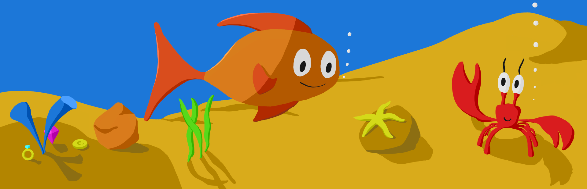
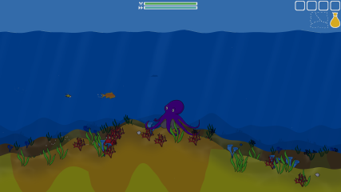
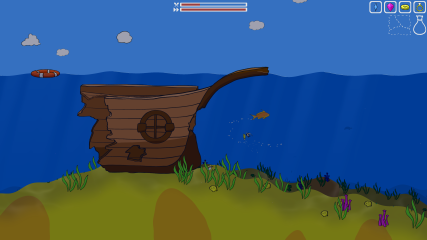
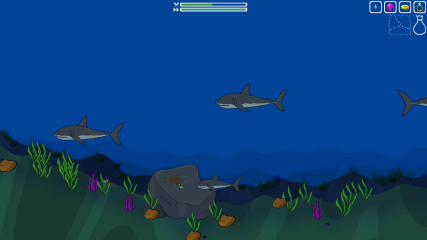
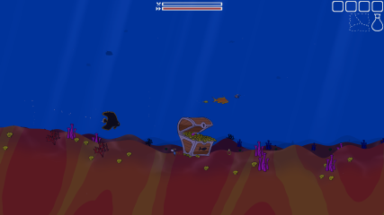
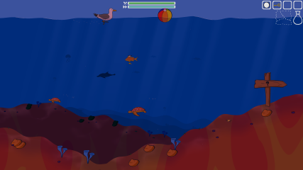

# Invincible Fins

A game recommended for younger kids. You control a little fish that just got back to the ocean from a thrown away aquarium. Explore the colorful underwater world, collect treasures, avoid dangers and find your new home.

- No menus, just hit the play button (Space / A on controller) and continue where you left off
- Saving is automatic between scenes and upon exit (Alt-F4 or Esc)
- No violence, even the sharks are not deadly, they just make the player flee home. There is a penalty though, you lose all the collected treasures from the inventory.
- No tutorials, you have to figure out what to do - watch out for indications shown by Ollie, the crab
- No rush, play at your own pace; there is no time limit 
- Secret Area
- Playable by controller or keyboard

<iframe src="https://store.steampowered.com/widget/1481880/" frameborder="0" width="646" height="190"></iframe>

### Controls

- Start Game - Space button / A on Controller
- Exit Game - Alt-F4 / Esc
- Move - Arrow keys / D-Pad / Left Stick
- Short Sprint - Space button / A on Controller while moving
- Blow Bubble - Space button / A on Controller while not moving
- Drop Item - Enter button / B on Controller
- Change Player Character - X button / X on Controller (only in secret area while over another fish)

### There are three little fish that follow you

- One helps to spot treasures
- One always swims around you so you can find yourself more easily on the screen
- One is controllable via the W, A, S, D keys or a second controller, but it can only interact with the beach ball - this allows 2 children to play together or a parent to play with their child

___
### Developed by [Reggelente](https://reggelente.com)
### Music by [Humming Composer](https://www.hummingcomposer.com)
